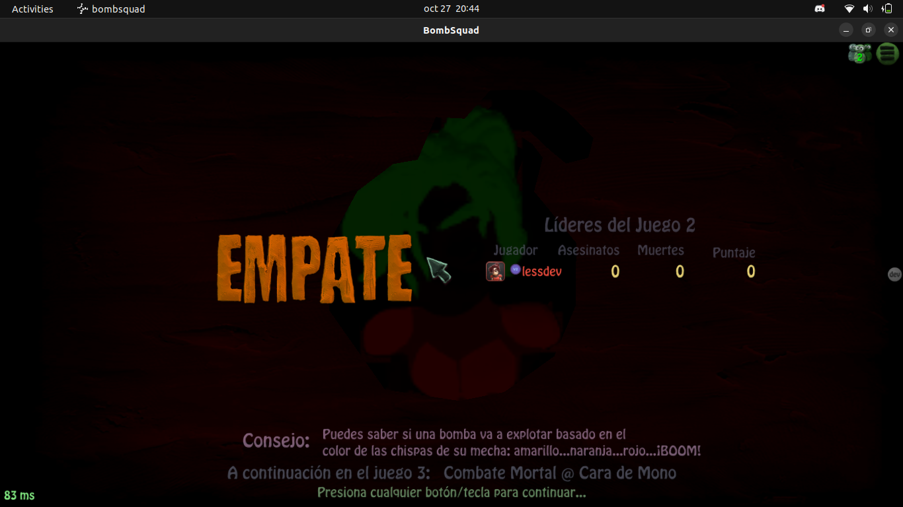
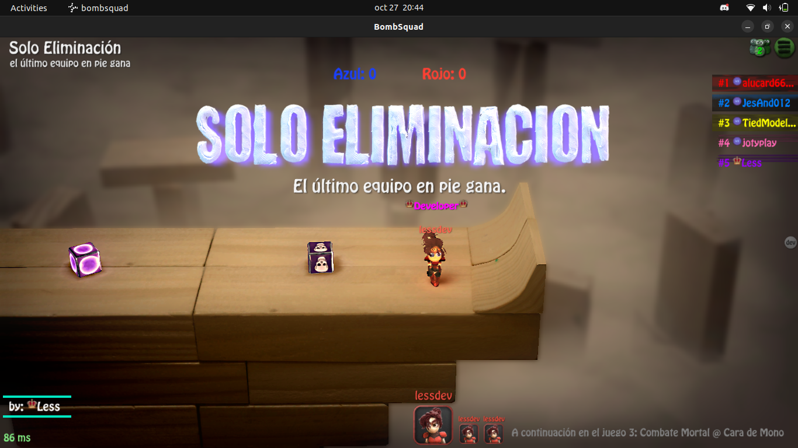
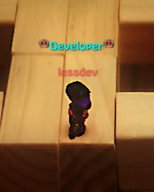
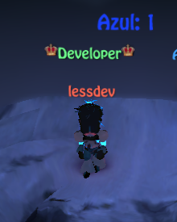
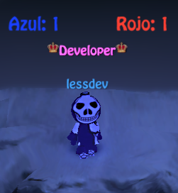

# Less Server Scripts v1.1.5

A comprehensive BombSquad server manager with Docker support, making it easy to deploy and maintain multiple server instances with advanced features and mods.

> **Running on BombSquad 1.7.51 (API 9)**

---

## Quick Start

### Requirements

- **Docker** and **Docker Compose** installed
- **A VPS** - AWS, Google Cloud, Azure, or any Linux server
- **Memory** - 1 GB minimum (2 GB recommended)
- **Python 3.13** on local machine for deployment script

---

## Installation

### 1. Clone Repository

```bash
git clone --depth=1 https://github.com/danigomezdev/bombsquad
cd bombsquad
```

### 2. Configure Environment

```bash
# Copy environment template
cp .env.example .env

# Edit with your settings
nano .env
```

**Environment Variables:**
```bash
ENVIRONMENT="production"      # or "development"
SERVER_NAME="less_east_c1"    # Server folder name
PARTY_NAME="Teams @ Less"     # Public server name
PORT="43210"                  # UDP port
SSH_HOST="ubuntu@your-server" # Remote server
SSH_KEY="~/.ssh/yourkey.pem"  # SSH key path
```

### 3. Deploy to Server

```bash
# Quick deploy presets
./deploy.sh dev   # Deploy to /home/ubuntu/tests/test (port 6666)
./deploy.sh prod  # Deploy to /home/ubuntu/servers/less (port 43210)

# Or use custom .env configuration
./deploy.sh
```

### 4. Start Server

**On remote server:**
```bash
# SSH into server
ssh -i ~/.ssh/yourkey.pem ubuntu@your-server

# Navigate to deployed directory
cd /home/ubuntu/servers/less

# Start server
./docker.sh
# Select option 1 (Start server)
```

---

## Server Management

### Docker Management Script

The `docker.sh` script provides an interactive menu for managing your server:

```bash
./docker.sh
```

**Menu Options:**
```
1) Start server (build if needed)
2) Stop server
3) Restart server (config/mods changes only)
4) Rebuild and restart (code changes)         <- Use after deploy
5) View logs (live)
6) View logs (last 200 lines)
7) Force full rebuild (clean rebuild)
8) Server status
9) Enter container shell
0) Stop and remove container
```

### Common Workflows

**After editing config or mods:**
```bash
./docker.sh
# Option 3 - Restart (5 seconds)
```

**After deploying code changes:**
```bash
./deploy.sh prod
# Then on server:
./docker.sh
# Option 4 - Rebuild and restart (30-60 seconds)
```

**View logs in real-time:**
```bash
./docker.sh
# Option 5 - View logs (live)
```

---

## Project Structure

```
bombsquad-server/
├── assets/                      # Screenshots and media
├── dist/
│   ├── ba_data/                 # Python modules (bacommon, efro)
│   ├── ba_root/
│   │   └── mods/
│   │       ├── characters/      # Custom character mods
│   │       ├── chathandle/      # Chat commands system
│   │       ├── features/        # Server features
│   │       │   ├── afk_check.py
│   │       │   ├── announcement.py
│   │       │   ├── discord_bot.py
│   │       │   ├── fire_flies.py
│   │       │   ├── team_balancer.py
│   │       │   └── votingmachine.py
│   │       ├── playersdata/     # Player profiles and roles
│   │       ├── serverdata/      # Server logs and data
│   │       ├── stats/           # Player statistics
│   │       └── tools/           # Utility scripts
│   └── bombsquad_headless       # Server binary
├── bombsquad_server             # Main server script
├── config.toml                  # Server configuration
├── docker-compose.yml           # Docker setup
├── docker.sh                    # Server management script
├── deploy.sh                    # Deployment script
├── Dockerfile                   # Docker image definition
├── .env                         # Environment config (not in repo)
└── .env.example                 # Environment template
```

---

## Features

### Server Management
- **Multi-Server Support** - Run multiple servers on one machine with unique names
- **Docker Containerization** - Isolated, reproducible server environments
- **Smart Deployment** - Separate dev/prod environments with data protection
- **Auto-Restart** - Server restarts automatically if it crashes
- **Easy Updates** - Quick rebuild system for code changes

### Gameplay Features
- **Character Chooser** - Players can select their character on join
- **Custom Characters** - Support for custom character mods
- **Team Auto-Balance** - Automatic team balancing
- **AFK Detection** - Automatic AFK player removal
- **Vote System** - Custom voting for maps, modes, and kicks
- **Fireflies Mode** - Visual effects during night mode
- **Map Announcements** - Display messages on maps

### Player Management
- **Advanced Stats System** - Track player statistics and rankings
- **Role System** - Custom roles with permissions (Owner, Admin, VIP, etc.)
- **Player Profiles** - Persistent player data across sessions
- **Kick/Ban System** - Player moderation tools
- **Whitelist Support** - Restrict server access

### Chat & Communication
- **Team Chat** - Prefix messages with comma for team-only chat
- **Popup Chat** - Prefix messages with dot for prominent display
- **Chat Commands** - Extensive command system
- **Profanity Filter** - Optional chat filtering
- **Discord Integration** - Link server to Discord bot

### Statistics & Tracking
- **Live Leaderboard** - Top 5 players displayed in-game
- **Rank Progression** - Player ranking system
- **Stats Web Interface** - View stats via web browser
- **Auto Stats Reset** - Scheduled stats reset

### Server Customization
- **Auto Night Mode** - Automatic lighting changes based on time
- **Custom Team Names** - Configurable team names and colors
- **Server Branding** - Custom host name and device name
- **Flexible Playlists** - Custom game mode playlists

---

## Screenshots

### Gameplay





### Characters

<div align="center">

| Character Mods | Character Mods |
|:---:|:---:|
|  |  |
|  |  |

</div>

---

## Configuration

### Server Settings

Edit `config.toml` for basic server settings:

```toml
party_name = "Teams @ Less Server"
port = 43210
max_party_size = 7
session_type = "teams"
team_names = ["Blue", "Red"]
```

### Advanced Settings

Edit `dist/ba_root/mods/setting.json` for advanced features:

```json
{
  "character_chooser": { "enable": true },
  "autoTeamBalance": true,
  "afk_remover": { "enable": true },
  "autoNightMode": {
    "enable": true,
    "startTime": "18:00",
    "endTime": "06:00"
  }
}
```

### Player Roles

Edit `dist/ba_root/mods/playersdata/roles.json`:

```json
{
  "owners": ["pb-YourAccountID"],
  "admins": [],
  "vips": []
}
```

To get your account ID, use `/getaccountid` command in-game.

---

## Deployment Modes

### Development Mode

```bash
./deploy.sh dev
```

- Deploys to `/home/ubuntu/tests/test`
- Port: 6666
- Overwrites all data (including stats)
- Perfect for testing changes

### Production Mode

```bash
./deploy.sh prod
```

- Deploys to `/home/ubuntu/servers/less`
- Port: 43210
- Preserves player data and stats
- Safe for live servers

### Custom Configuration

Edit `.env` and run:
```bash
./deploy.sh
```

---

## Multi-Server Setup

You can run multiple servers on the same machine:

```bash
# Server 1
cd /home/ubuntu/servers/server_1
./docker.sh  # Runs as server_1-server on port from config

# Server 2
cd /home/ubuntu/servers/server_2
./docker.sh  # Runs as server_2-server on different port

# Both run simultaneously without conflicts
```

Each server gets unique:
- Container name (based on directory)
- Image name
- Network
- Volumes
- Port

---

## Troubleshooting

### Check Server Status

```bash
./docker.sh
# Option 8 - Server status
```

### View Logs

```bash
./docker.sh
# Option 5 - Live logs
# Option 6 - Last 200 lines
```

### Enter Container Shell

```bash
./docker.sh
# Option 9 - Enter container shell
```

### Rebuild from Scratch

```bash
./docker.sh
# Option 7 - Force full rebuild
```

### Common Issues

**"ModuleNotFoundError: No module named 'bacommon'"**
- Solution: Rebuild image (option 4 or 7)

**"Container exists but is stopped"**
- Solution: Use option 1 (will auto-remove and recreate)

**Port already in use**
- Solution: Change `PORT` in config.toml or .env

---

## Credits

**Original Creation:** [BombSquad Community](https://github.com/bombsquad-community/)

**Maintained by:** [Less](https://github.com/danigomezdev)

---

## License

See [LICENSE](LICENSE) file for details.
